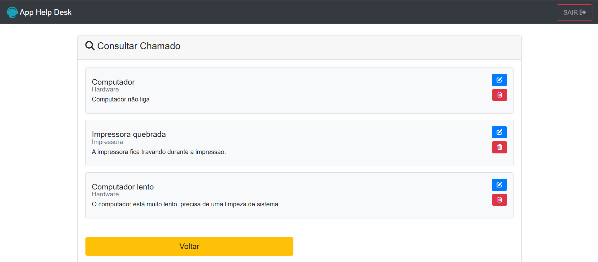
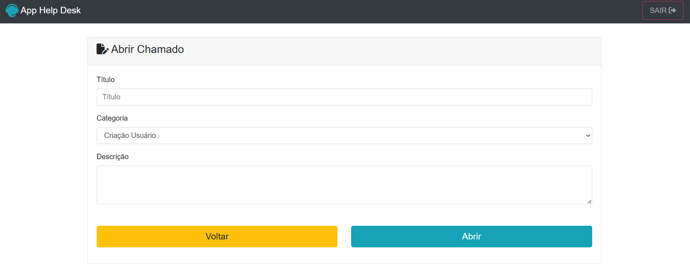

# 🛠️ **App Help Desk**

**App Help Desk** é um sistema para gerenciamento de chamados de suporte técnico.

---

  
  

---

## 🚀 **Funcionalidades**

- **Login e autenticação**
- **Criação de chamados**
- **Consulta de chamados**
- **Edição de chamados**
- **Exclusão de chamados**
- **Controle por perfil**

## 🧑‍💻 **Tecnologias Utilizadas**

- **PHP** (sem frameworks)
- **HTML/CSS** (com **Bootstrap 4** para layout responsivo)
- **Armazenamento em arquivo** `.hd` (utilizando funções de leitura e escrita em PHP)

